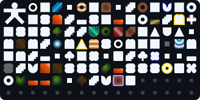

<div align="center">

# ⛏️ BREAKME

**An incremental game with progress based on your `git` usage.**

[](https://github.com/marketplace/actions/breakme-md)
[](https://nodejs.org/)
[](./LICENSE)
[](./src)
[](https://github.com/sponsors/RVYA)

---

</div>

## How It Works

BREAKME embeds an interactive SVG mining board directly on your GitHub profile:

- **Mining Blocks**: Every time you commit, open a PR, or publish a release, BREAKME deals damage and breaks tiles across infinite procedural chunks.
- **Streaks & Multipliers**: Coding on consecutive days builds daily streaks that multiply your mining power up to `4.0x`.
- **Collectibles**: Breaking blocks unearths rare loot items that display with hover tooltips in your profile collection.
- **Dynamic Theming**: Board colors are deterministically generated from your GitHub username with guaranteed dark-mode contrast.

---

## Setup

### 1. Add markers to your profile `README.md`

Add these comment tags where you want the board to appear:

```html
...

<!-- BREAKME:START -->
<div align="center">

## BREAKME.md

<table align="center" width="640" style="width: 100%; max-width: 640px;">
  <tr>
    <td align="center" width="25%">⛰️<i>CHUNK</i><b>#002</b></td>
    <td align="center" width="25%">🪨<i>TILE</i><b>#039</b></td>
    <td align="center" width="25%">🔥<i>STREAK</i><b>#007</b></td>
    <td align="center" width="25%">⛏️<i>BROKEN</i><b>#231</b></td>
  </tr>
  <tr>
    <td colspan="4" align="center">
      
    </td>
  </tr>
  <tr>
    <td colspan="4" align="center">
      COLLECTED (003/250): <span>Test Collectible #2</span> <span>Test Collectible #1</span> <span>Test Collectible #3</span>
    </td>
  </tr>
</table>

</div>
<!-- BREAKME:END -->

...
```

### 2. Add the GitHub Action

Create `.github/workflows/breakme.yml` in your profile repository:

```yaml
name: BREAKME Game Loop

on:
  schedule:
    - cron: "0 * * * *"
  workflow_dispatch:

concurrency:
  group: breakme-game
  cancel-in-progress: false

permissions:
  contents: write

jobs:
  turn:
    runs-on: ubuntu-latest
    steps:
      - uses: actions/checkout@v4

      - name: Play BREAKME
        uses: RVYA/BREAKME@v1
        with:
          # (Optional) Add your secret BREAKME_PAT to count private commits/PRs
          github_token: ${{ secrets.BREAKME_PAT || secrets.GITHUB_TOKEN }}

      - name: Save Game Board
        run: |
          git config --global user.name "github-actions[bot]"
          git config --global user.email "github-actions[bot]@users.noreply.github.com"
          git add state.json BREAKME-board.svg README.md
          if ! git diff --staged --quiet; then
            git commit -m "chore(game): update BREAKME board [skip ci]"
            git pull --rebase -X theirs origin main
            git push
          fi
```

---

## About Privacy

BREAKME is designed with a strict privacy-first architecture:

- **What is processed**: Only the high-level event type (e.g. `PushEvent`, `PullRequestEvent`), timestamp (for calculating daily streaks), and event count.
- **What is NEVER processed or stored**: No commit messages, repository names, branch names, file names, code diffs, issue titles, or PR descriptions.
- **Zero Third-Party Servers**: No external tracking, analytics, or remote database. All execution happens entirely inside your GitHub Actions runner, and state is stored strictly inside your repository's `state.json`.

---

## Action Map

BREAKME listens to the GitHub Events API and converts activity into in-game damage:

| GitHub Event       | Action                           | In-Game Effect                   |
| :----------------- | :------------------------------- | :------------------------------- |
| `PushEvent`        | Committing & pushing code        | Regular mining damage per commit |
| `PullRequestEvent` | Opening or merging pull requests | Heavy mining strike              |
| `ReleaseEvent`     | Publishing releases & tags       | Critical hit                     |
| `IssuesEvent`      | Opening or closing issues        | Support strike                   |
| `CreateEvent`      | Creating branches or tags        | Light strike                     |

---

## License

[Apache-2.0](./LICENSE)
